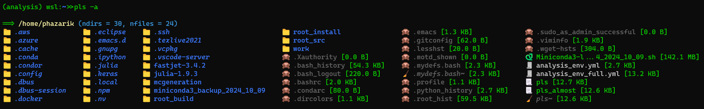

# Tools: TLDR

This is a collection of terminal-based utilities, each designed to streamline specific tasks in UNIX-like environments. Each tool resides in its own subfolder with a dedicated README and downloadable asset. Some of these tools are highly specific to my own workflows, while others may be broadly useful.

---

### [lxplus-genxsec](lxplus-genxsec/README.md) 

Tools to extract generator-level cross sections from CMS datasets using the `GenXSecAnalyzer`.  
The workflow queries DAS for MiniAODs, parses logs, and extracts cross-section values, working within a CMSSW environment. Ideal for validating MC samples or preparing configs for private production.

```bash
wget https://github.com/phazarik/tools/releases/download/lxplus-v1.0/bulksubmission.py
wget https://github.com/phazarik/tools/releases/download/lxplus-v1.0/find_xsec_fromDAS.py
```

📖 [GenXSecAnalyzer Documentation ](https://cms-generators.docs.cern.ch/useful-tools-and-links/HowToGenXSecAnalyzer/)

---

### [lxplus-xrdcp](lxplus-xrdcp/README.md) 

A two-step workflow to directly download files from CMS DAS into your lxplus area using `xrdcp`.  
Useful for one-off studies or selective file access without relying on CRAB.

```bash
wget https://github.com/phazarik/tools/releases/download/lxplus-v1.0/makelist.py
wget https://github.com/phazarik/tools/releases/download/lxplus-v1.0/xrdcp_files.py
```

---

### [pls](pls/README.md) 


A terminal-friendly replacement for the `ls` command, with support for emojis, color themes, and file-type awareness. Especially useful on mounted file systems in WSL or in environments where `ls --color` does not render properly.



[](https://github.com/phazarik/tools/releases/download/pls1.0/pls)

```bash
wget https://github.com/phazarik/tools/releases/download/pls1.0/pls
```

---

Feedback, suggestions, and pull requests are welcome. I’m happy to consider fixes or improvements that keep them simple and self-contained. In case you need help or want to discuss ideas, feel free to contact me.
