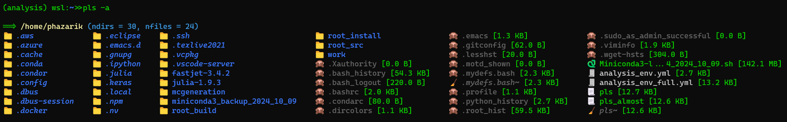

# `pls` : A Customizable, Emoji-Friendly `ls` Replacement

[](https://www.python.org/) [](https://pypi.org/project/wcwidth/)

A Python-based alternative to the `ls` command, designed for better readability and customization using ANSI colors and emojis. Works reliably across Linux, WSL, and mounted file systems.

> **Advantage over `ls`:**   On WSL, especially when accessing mounted Windows partitions (e.g., `/mnt/c/...`), native `ls --color=tty` may fail to render colors due to permission inconsistencies. `pls` fixes that. Also it supports mutliple directory paths at once.



## ✨ Features
- 🎨 Customizable styling via the `STYLE` dictionary (color + emoji)
- 🧠 Extension-aware: supports `.py`, `.root`, `.h`, `.so`, `.C`, etc.
- ✂️ Smart truncation: middle-ellipsis shortening while preserving file extensions
- 📏 Human-readable sizes: formats like `KB`, `MB`, etc.
- 📁 Multi-directory support: list several paths at once
- 🧩 Wildcard support: glob-style matching (e.g., `pls dir*`)
- ⚙️ Hybrid CLI: combines `sys.argv` and `argparse` for flexible usage
- 📋 `-l` for detailed view: PERMS, USER, GROUP, SIZE, MODIFIED, NAME

## ⚙️ Installation
```bash
cd ~/                        # Go to home area
pip install wcwidth          # Python3 module 
wget https://github.com/phazarik/tools/releases/download/pls1.0/pls
chmod +x ~/pls               # Make it executable
sudo ln -sf "$HOME/pls" /usr/local/bin/pls  # Create a symbolic link
```

## 🧪 Usage
```bash
pls                   # Basic listing in columns
pls -a                # Include hidden files and directories
pls -l                # Show file sizes and metadata (like 'ls -lh')
pls -al               # Combine flags
pls --filter root     # Show only files with 'root' in their extension
pls --sortby n        # Alphanumeric sort: 1, 2, ..., 10 (instead of 1, 10, 2)
pls dir1 dir2         # List contents of multiple directories (supports wildcards)
```

----
### 🎁 Bonus info for emacs users
For proper emoji rendering in Emacs, add the following to your `~/.emacs`file.
```elisp
(set-fontset-font t 'unicode "Noto Color Emoji" nil 'append)
```
Make sure that the font "Noto Color Emoji" is available.